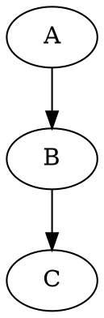

# Lista Processamento de Consultas

1. Defina plano de execução da consulta. Dê um exemplo.

Plano de execução da consulta é uma sequência de Avaliações Primitivas.

Um exemplo de plano de execução de consulta seria pegar todos os usuários com mais de 18 anos.

