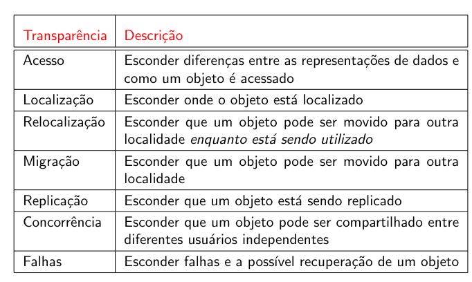

# Lista 1

1. O que é um sistema distribuído?

```
Um Sistema Distribuído é uma coleção de elementos computacionais, hardwares e softwares, autônomos que, para o usuário, paracem um único sistema coerente.
```


2. Por que nome nos referimos a cada elemento computacional dentro de um sistema distribuído?

```
Nos referimos a cada elemento computacional dentro de um sistema pelo nome nó
```

3. O que significa dizer que um sistema distribuído deve ser coerente?

```
A coleção de nós opera sempre da mesma forma, não imporando onde, quando ou como a interação entre um usuário e o sistema acontece.

Exemplos:

- Um usuário não consegue dizer onde a computação está acontecendo
- Onde especificamente os dados estão armazenados deveria ser irrelevante para a aplicação
- O dado ser ou não replicado deveria estar completamente escondido
```

4. O que significa transparência de distribuição?

```
Parte da definição de sistemas distribuídos é que eles normalmente se apresentam como um sistema único aos usuários, ocultando o fato de processos e recursos estarem fisica e muitas vezes geograficamente distribuídos. Tal característica define o sistema como transparente.

Transparência neste contexto então significa que o programador e/ou usuário não pode ver ou identificar que o sistema é distribuído. As principais formas de transparência são: acesso, localização, migração/mobilidade, relocação, replicação, concorrência e falha.
```

5. Qual a função do *middleware*?

```
A função do middleware é disponibilizar funçõese componentes que são comumente usados e que não queremos reimplementar em cada aplicação separadamente.
```

6. Um usuário desconhecer se um determinado objeto é ou não compartilhado caracteriza transparência de:

```
Concorrência
```

7. Um usuário desconhecer diferenças na representação dos dados e como são acessados caracteriza transparência de:

```
Acesso
```



8. O que significa ser aberto, para um sistema distribuído?

```
Significa que um sistema distribuído são capazes de interagir com outros sistemas abertos, ou seja, devem respeitar interfaces bem definidas, devem ser facilmente interoperáveis, devem permitir a portabilidade de aplicações e devem ser fáceis de estender. Assim os sistemas distribuídos podem ser independentes de hardwares, plataformas e linguagens.
```

9. No que consiste um cluster de computadores?

```
Um cluster de computadores consiste em um grupo de computadores de boa qualidade conectados via LAN, sendo todos eles homogêneos, ou seja, mesmo SO e hardware quase identico e um único nó gerenciador
```

10. No que consiste um grid (grade) de computadores?

```
Um grid consiste em um grupo de computadores, que geralmente formam uma rede de longa disância, com vários nós vindo de todos os cantos, são heretogêneos, ou seja, os nós são configurados para tarefas específicas e espalhados entre diversas organizações
```

11. Qual a principal característica da computação em nuvem?

```
A principal característica da computação em nuvem é que recursos podem ser distribuídos e acessados à partir da rede de internet podendo ser de infraestrutura, plataforma e aplicações. São entregues utilizando técnicas de virtualização para alocação e gerenciamento de armazenamento e servidores virtuais
```

12. Em sistemas distribuídos de processamento de transaçoẽs, quais propriedades suas transações devem ter?

```
As propriedades que as transações devem ter são: Atomicidade, Consistência, Isolamento e Durabilidade

Atomicidade: ou todas as operações são bem sucedidas, ou todas falham. Quando uma transação falha, o estado do objeto permanecerá inalterado

Consistência: uma transação estabelece um estado de transação válido. Isto não exclui a existência de estados intermediários inválids durante sua execução

Isolamento: transações concorrentes não interferem entre si. Para uma transação T, é como se as outras transações ocorressem ou antes de T ou depois de T

Durabilidade: Após o término de uma transação, seus efeitos são permanentes: mudanças de estado sobrevivem a falhas no sistema
```

13. Que nome damos às transações construídas como um conjunto de subtransações?

```
O nome que damos para transações construídas como um conjunto de subtransações são Transações distribuídas ou Transações aninhadas
```

14. O que é um sistema pervasivo?

```
Um sistema pervasivo é um sistema com nós pequenos, móveis e normalmente embutidos em um sistema muito maior, são caracterizados pelo fao do sistema naturalmente se misturar ao ambiente do usuário
```

15. Redes de sensores são exemplos de que tipo de sistema distribuído?

```

```
