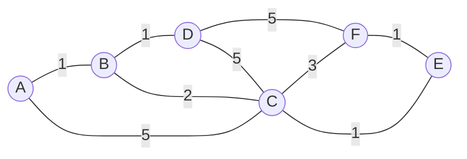

# Lista de Exercícios - P2

```mermaid
	flowchart LR
		A((A)) ---|1| B((B))
		A ---|5| C((C))
		B ---|1| D((D))
		B ---|2| C
		D ---|5| F((F)) & C
		C ---|3| F
		C & F ---|1| E((E))
```

1. [Busca cega](./busca-cega.md)

2. Busca informada

3. Programação Dinâmica

- Síncrona

- Assíncrona
