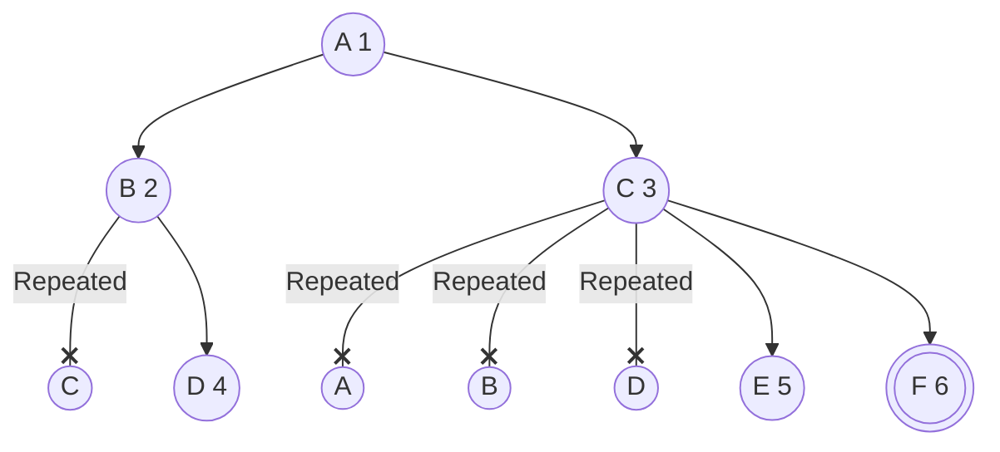
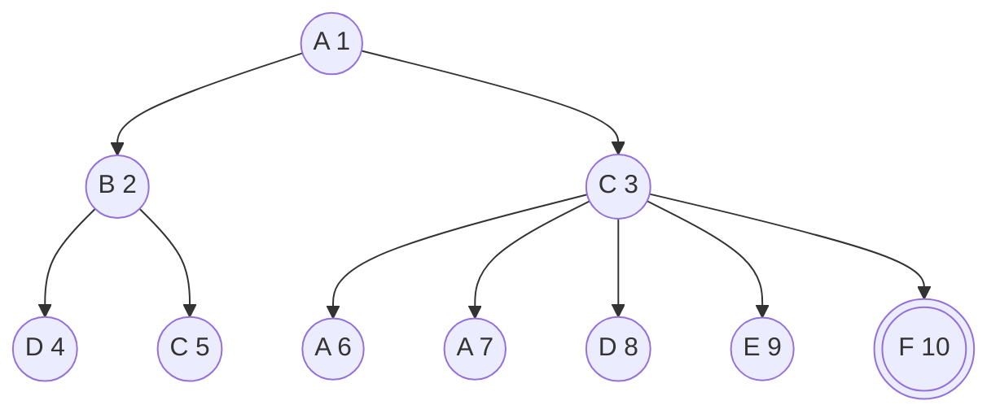
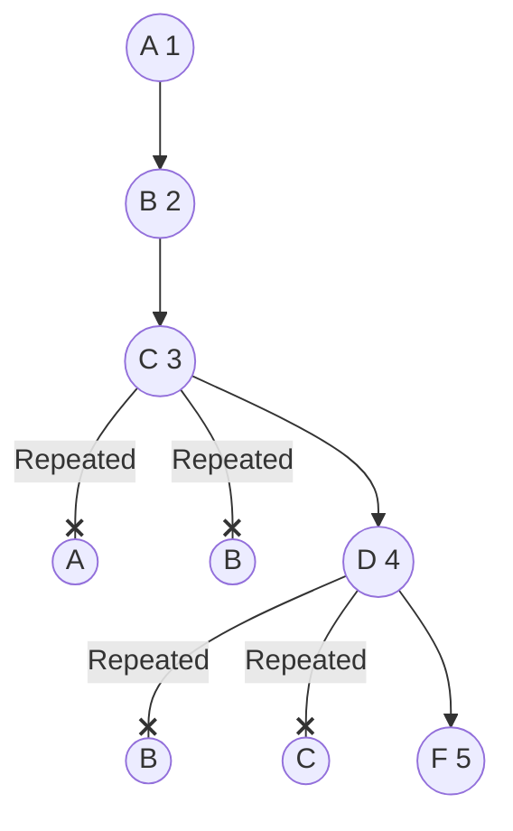
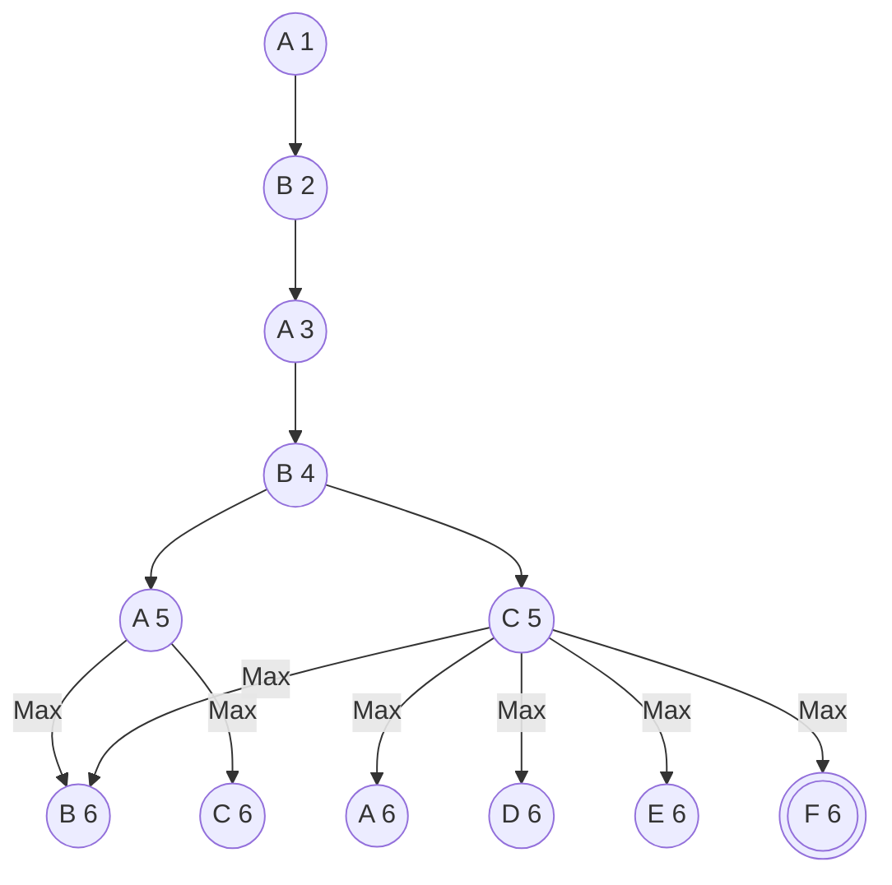
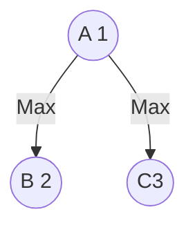
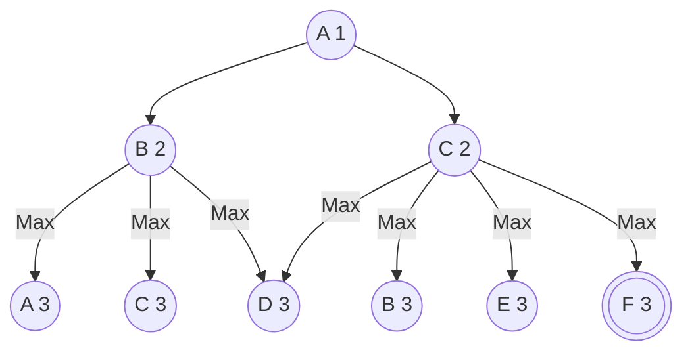
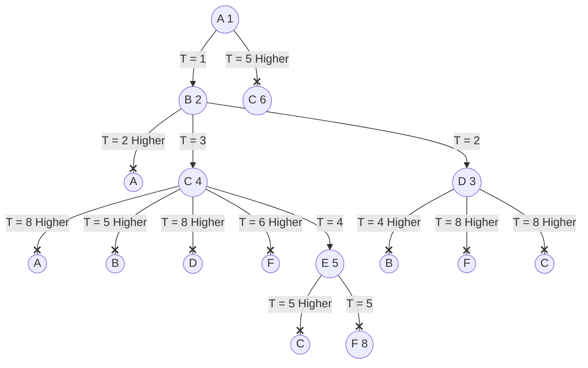

- Busca em largura sem repetir nós na árvore.

- Busca em largura sem checar para repetição de nós (permita que nós sejam repitidos).

- Busca em profundidade sem repetir nós na árvore.

- Busca em profundidade limita ($l = 6$nós) sem checar para repetição de nós (permita que nós sejam repitidos).

- Busca em profundidade iterativa sem checar para repetição de nós (permita que nós sejam repitidos)

$$l = 1$$

$$l = 2$$

$$l = 3$$

- Busca de custo uniforme (desempate pelo nó mais raso e depois pela ordem alfabética ). Quando ocorrer nós repitidos, mantenha apenas o de menor custo acumulado.

